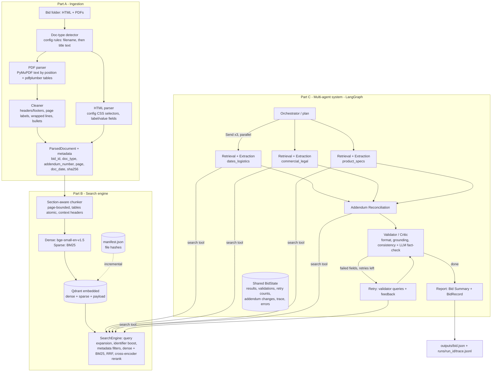
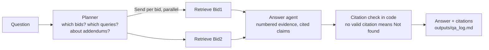

# RFP Intelligence Platform

A RAG search engine and a multi-agent system that make bid / RFP documents **searchable, answerable and extractable**. Every value and every answer is backed by a citation to a source file and page.

- **Extraction mode:** a bid folder becomes a structured JSON record of 20 fields, each with value, sources, confidence and notes, plus an addendum change log and a validation summary.
- **Question-answering mode:** natural-language questions get answers with numbered citations (`[1]`, `[2]`, ...), or "Not found in documents."

Built on Python 3.11, LangGraph, Qdrant (embedded), FastEmbed (dense + BM25 + cross-encoder), FastAPI and Anthropic Claude.

---

## Contents
1. [Quick start](#quick-start)
2. [How to run each mode](#how-to-run-each-mode)
3. [Architecture](#architecture)
4. [Design decisions](#design-decisions)
5. [Evaluation results](#evaluation-results)
6. [Project structure](#project-structure)
7. [Configuration](#configuration)
8. [Assumptions](#assumptions)
9. [Known limitations and future work](#known-limitations-and-future-work)
10. [Deliverables index](#deliverables-index)

---

## Quick start

**Requirements:** Python 3.11+, [uv](https://docs.astral.sh/uv/), and an Anthropic API key (needed only for the LLM agents; search works without one).

```bash
git clone <repo-url> rfp-intelligence && cd rfp-intelligence
uv sync                                  # creates .venv and installs pinned dependencies
cp .env.example .env                     # then put your key in ANTHROPIC_API_KEY=
uv run python main.py llm-check          # verifies the key and both model tiers
```

Then process a bid with **one command**. This ingests and indexes it (incrementally), then runs the full multi-agent extraction:

```bash
uv run python main.py extract data/bids/Bid1
```

It writes `outputs/Bid1.json` and a full agent trace in `runs/<run_id>/`. On first use, the embedding, BM25 and reranker models (about 160 MB) are downloaded once and cached locally.

A **new, unseen bid** needs no code changes: put its files in `data/bids/<BidName>/` and run the same command.

---

## How to run each mode

### CLI (`uv run python main.py --help`)

| Command | What it does |
|---|---|
| `extract <folder>` | **Extraction mode.** Ingest + index + multi-agent extraction → `outputs/<bid>.json` |
| `ask "<question>"` | **Q&A mode.** Cited answer; appended to `outputs/qa_log.md` |
| `index <folder>` | Ingest and index a bid folder (incremental: unchanged files are skipped) |
| `search "<query>" [--bid Bid2] [--doc-type specs] [--mode hybrid_rerank] [-k 5]` | Search engine on its own, with citations |
| `ingest <folder>` | Parse and clean only; writes `data/processed/<bid>/` and an ingestion report |
| `serve` | Start the REST API (interactive docs at `http://127.0.0.1:8000/docs`) |
| `llm-check` | One tiny call per model tier to verify configuration |
| `chunk`, `extract-group`, `reconcile`, `validate` | Development helpers to run a single stage |

### REST API (`uv run python main.py serve`)

| Method | Endpoint | Purpose |
|---|---|---|
| GET | `/health` | Status and number of indexed chunks |
| GET | `/bids` | Indexed bids, their files and chunk counts |
| POST | `/index` | `{"folder": "data/bids/Bid1", "force": false}`: ingest and index (only folders inside `data/bids`) |
| GET | `/search?q=...&bid_id=...&doc_type=...&addendum_number=...&top_k=5&mode=hybrid_rerank` | Hybrid search with citations |
| POST | `/ask` | `{"question": "..."}`: Q&A mode |
| POST | `/extract` | `{"bid_id": "Bid1"}`: extraction mode (synchronous; takes a few minutes) |

Embedded Qdrant allows one process at a time. While `serve` is running, use the API rather than the CLI.

### Evaluation

```bash
uv run pytest -q                                   # 98 unit tests (parsing, search, agents, API, scorer)
uv run python eval/run_retrieval_eval.py           # Recall@k / MRR / nDCG for 6 retrieval configurations
uv run python eval/run_extraction_eval.py          # field accuracy vs. gold for outputs/*.json
uv run python eval/run_stability.py 3 Bid1 Bid2    # N full runs per bid; per-field stability
```

---

## Architecture

### Extraction mode



### Q&A mode



For addendum questions, retrieval does a **second hop**: each top addendum passage's *change sentence* (for example "The new due date ... will be July 9") is used, with the change word removed, as a query over the base documents. That finds the original statement it replaces.

### Agents

| Agent | Responsibility | Model tier |
|---|---|---|
| Orchestrator / Planner | Checks the bid is indexed, chooses field groups (from the registry), routes, and decides retry vs. report | none (code) |
| Ingestion | Detect, parse, clean, tag metadata, trigger indexing | none (code) |
| Retrieval | Runs each field's queries, fuses rankings (RRF), neighbour expansion for long lists, per-run query cache; never passes whole documents | none (search tool) |
| Extraction ×3 | One specialist per field group; returns values with evidence IDs only | fast (Haiku 4.5) |
| Addendum Reconciliation | Original value (base docs) vs. addendum changes; latest addendum wins; change log | smart (Sonnet 5.5) |
| Validator / Critic | Deterministic format, grounding and consistency checks, then an LLM fact-check; returns retry queries | code + smart |
| Report | Bid Summary (3–6 sentences) and final `BidRecord` | fast |
| Q&A planner / answer | Routes the question to bids and queries; writes a cited answer | fast / smart |

---

## Design decisions

### Ingestion
- **The PDF text is rebuilt row by row from word positions**, not block by block. The Dell quote is a borderless table (description column + SKU column), and block order separated every SKU from its description. Words whose vertical centres are within **5 pt** share a line. This value was chosen by testing 3 / 5 / 7 pt on the real documents.
- **Table handling:** pdfplumber tables become markdown, except **layout tables** (1 column, or 2 columns of long prose) and **form tables** (≥ 40% empty cells), which are rendered as `label: value` text. Wrapped lines inside cells are joined, without ever splitting an email or URL.
- **HTML:** trafilatura was evaluated and **rejected**. On the BidNet pages it returned only cookie banners and lost every bid detail. The parser instead reads label/value fields through **CSS selectors in `config/html_rules.yaml`**, with fallbacks to `<table>`, `<dl>` and cleaned full text. Portal text shortened with "See more" is marked `[truncated on portal page]`.
- **Doc types** come from YAML rules: the file name first, then the first page's title text. Bid1's main RFP is named `...FINAL.pdf` and is detected from its title.

### Chunking
- **Section-aware and page-bounded.** A chunk never crosses a page, so every citation is one exact page. Headings come from fonts *and* text patterns (`1.2 Terms`, `Section 2 –`, ALL CAPS, headings glued to a paragraph). Table rows (containing a column break) are never headings.
- **Target 500 tokens, maximum 650, 80-token overlap** between chunks of the same section. Sections smaller than 80 tokens merge with the next one. Large tables are split by rows with the header repeated.
- **Contextual chunk headers** (`[Bid: Bid1 | Doc: Addendum 2 ... (addendum #2) | Page 1 | Section: ...]`) are embedded and BM25-indexed, so a query like "Bid1 addendum 2 due date" matches a chunk whose text never says "addendum".

### Retrieval
- **Hybrid:** dense `BAAI/bge-small-en-v1.5` (meaning) + sparse BM25 with Qdrant IDF (exact identifiers such as `JA-207652`, `WD22TB4`), merged with **Reciprocal Rank Fusion** (k = 60). RRF works on ranks, because cosine and BM25 scores aren't comparable.
- **Query expansion** (synonym groups in `config/query_expansion.yaml`) feeds **BM25 only**. The dense model already handles synonyms, and extra words would blur its meaning. Queries containing identifiers double the BM25 weight.
- **Reranker:** `Xenova/ms-marco-MiniLM-L-6-v2` on chunk text, without the header. It beat the 12× larger `bge-reranker-base` on our evaluation (see below), and the header was shown to confuse it.
- **Rerank depth:** interactive search reranks 30 candidates. Agent searches rerank **12** (2.8× faster extraction) except for fields that need depth (`rerank_candidates: 30` in the field registry). The retrieval evaluation predicted this trade-off, and the stability test identified exactly which fields needed the override.
- **Incremental indexing:** `data/index/manifest.json` stores a sha256 per file. Unchanged files are skipped, changed files are replaced, and deleted files are removed.

### Agents
- **LangGraph,** because the problem is a graph: a fan-out with `Send` for parallel specialists, reducers that merge parallel updates into one shared state, and a conditional edge for the validator → retry loop. Services (store, LLM client) are passed through a closure, so the state stays plain, inspectable data.
- **Field registry (`config/fields.yaml`):** each field's description, hints, queries, format, group and retrieval overrides. The agents loop over this file, so nothing is hard-coded to Bid1 or Bid2.
- **Structured outputs without a framework:** every agent message is a Pydantic model sent to Claude as a forced tool call. Invalid output is sent back as a `tool_result` error for self-correction (up to 2 times), plus tenacity retries for transient API errors. Instructor was dropped after its API changed. Models that reject forced tool choice fall back to `auto` automatically.
- **Prompt caching** is enabled on system prompts. Repeated validator calls show cache reads in the traces.

### Guardrails: "the LLM proposes, code verifies"
1. **The LLM never writes a citation.** It returns evidence IDs (`E3`), and code maps them to file and page. Invented IDs are dropped, and a value with no valid ID becomes null ("Rejected: no valid citation").
2. **Identifier lists are copied by code.** The LLM locates the SKU list; a regex (`id_patterns` in the registry) copies every SKU from the cited files. This fixed a reproducible omission of 5 SKUs.
3. **The validator's grounding check:** every email, date, time and number in a value must appear in the cited text (dates and times compared by meaning). This caught an invented "Net 30" payment term.
4. **The LLM fact-check** also rejects values that are true but answer the wrong field (for example a 90-day proposal-validity period given as the contract term) and enforces field hints (for example a punch-out appendix contact given as the buyer).
5. **Reconciliation** only accepts a change that cites real *addendum* evidence.
6. **A failed retry never erases a previous answer:** a guardrail-rejected retry keeps the earlier value, flagged with lowered confidence.
7. **In Q&A, citations are checked in code:** `[n]` markers that don't refer to a real passage are removed, and an answer with no valid citation becomes "Not found in documents."

### Observability and error handling
Every graph node writes a trace event: node, latency, searches, every LLM call (model, input / output / cached tokens, latency, attempts) and any error. These go to `runs/<run_id>/trace.jsonl`, with totals in `summary.json`. Nodes catch their own exceptions, so a failure becomes null fields with a reason, and the graph always reaches the report. Ingestion never raises per file: corrupt, encrypted, unsupported and empty-page cases are recorded in `ingestion_report.json`.

---

## Evaluation results

### Retrieval (28 hand-verified question → gold passage pairs, both bids)

| Config | R@1 | R@3 | R@5 | R@10 | MRR | nDCG@10 |
|---|---|---|---|---|---|---|
| A. BM25 only | 0.57 | 0.82 | 0.86 | 0.86 | 0.69 | 0.74 |
| B. Dense only | 0.50 | 0.71 | 0.79 | 0.93 | 0.63 | 0.70 |
| C. Hybrid (RRF) | 0.64 | 0.82 | 0.89 | 0.93 | 0.75 | 0.79 |
| **D. Hybrid + MiniLM rerank (30 candidates)** | **0.68** | **0.93** | **0.96** | **1.00** | **0.81** | **0.86** |
| E. Hybrid + bge-reranker-base | 0.57 | 0.89 | 0.96 | 1.00 | 0.74 | 0.80 |
| F. Hybrid + MiniLM rerank (12 candidates) | 0.68 | 0.89 | 0.93 | 0.96 | 0.79 | 0.84 |

- Hybrid beats both single methods, and reranking gives the largest single gain (R@3 0.82 → 0.93).
- The small MiniLM reranker beat the 12× larger bge reranker on this data.
- F (agent setting) costs about one question in 28 versus D, in exchange for a 2.8× faster extraction.
- Caveats: 28 questions is small (one question = 0.036), and the questions were written after reading the documents.

Files: `eval/retrieval_eval_set.jsonl`, `eval/results/retrieval_results.md`, `eval/results/retrieval_details.json` (the rank of the first hit and the top 3 citations for every question and configuration).

### Extraction accuracy (19 extracted fields × 2 bids vs. hand-built gold)

The gold files (`eval/extraction_gold/`) state *how* each field is matched: required keywords (with alternatives), dates and times compared by meaning, fuzzy list recall, or must-be-null. Every gold change made after seeing output is logged with its reason in `eval/extraction_gold/CHANGELOG.md`.

| Measure | Result |
|---|---|
| Single run (latest `outputs/`) | **38/38 fields correct**, 0 false positives, all checked citations point to the right document |
| **Stability: 3 full runs per bid** | **106/114 field-runs correct (93%)**. 32 of 38 fields were correct in all 3 runs |

**Fields correct in every run include** both due dates (including Bid1's change by Addendum 2), bid numbers, contacts, terms, pre-bid meetings, delivery, all ten Bid1 product quantities, specifications, and **all expected nulls**. No run invented a bid bond, payment term, model number or part number.

**Fields not correct in every run** (run-to-run LLM variation) are listed under [Known limitations](#known-limitations-and-future-work).

Caveat: these are the **development** bids. Prompts and hints were refined while looking at them, so these numbers are not a generalisation estimate. See [Assumptions](#assumptions) for how unseen bids are handled.

### Speed and cost (MacBook Air, CPU only)

| Run | Before | After rerank-depth change |
|---|---|---|
| Bid2 (5 files, 30 chunks) | 351.7 s | **124.5 s** |
| Bid1 (4 files, 62-page RFP, 179 chunks, 2 addendums) | n/a | about 205 s |

A full extraction uses about **42k input tokens (Bid2)** and **74k input tokens (Bid1)**, split across Haiku (extraction and summary) and Sonnet (reconciliation and validation). Every run's token totals are in `runs/<run_id>/summary.json`.

---

## Project structure

```
rfp-intelligence/
├── main.py                     # Typer CLI: extract, ask, index, search, serve, ...
├── config/
│   ├── config.yaml             # tunables: chunking, search, LLM, agents
│   ├── fields.yaml             # the 20-field registry (drives all agents)
│   ├── doc_types.yaml          # doc-type detection rules
│   ├── html_rules.yaml         # portal HTML selectors
│   └── query_expansion.yaml    # synonym groups for BM25
├── src/rfp/
│   ├── settings.py             # config.yaml + .env loading
│   ├── schemas/                # documents, chunks, agent messages, BidRecord
│   ├── ingestion/              # detector, pdf_parser, html_parser, cleaner, pipeline
│   ├── search/                 # chunker, embeddings, store, indexer, query, fusion, reranker, engine
│   ├── llm/client.py           # Claude: structured output, retries, fallback, usage
│   ├── agents/                 # registry, retrieval, extraction, reconciliation, validator,
│   │                           # report, state, tracing, graph (extraction), qa (Q&A)
│   └── api/app.py              # FastAPI
├── eval/                       # retrieval + extraction evaluation, gold files, stability, results
├── tests/                      # 98 unit tests
├── scripts/inspect_pdf.py      # parser debugging helper
├── data/bids/                  # input bid folders (Bid1, Bid2, ...)
├── outputs/                    # Bid1.json, Bid2.json, qa_log.md, sample_trace/
└── runs/                       # per-run traces (git-ignored)
```

---

## Configuration

- **Secrets** come only from `.env` (`ANTHROPIC_API_KEY`). It's never committed; see `.env.example`.
- **Models** are set in `.env`: `LLM_MODEL_SMART` (default `claude-sonnet-5-5`) and `LLM_MODEL_FAST` (default `claude-haiku-4-5-20251001`).
- **Everything tunable** is in `config/config.yaml`: chunk sizes, search depth, RRF k, reranker model, rerank depth, retries and model tiers.
- **Optional:** `HF_HUB_OFFLINE=1` in `.env` skips Hugging Face update checks once the models are downloaded.

---

## Assumptions

- **One folder = one bid.** The folder name is the `bid_id`.
- **Inputs are PDF and HTML.** Other file types are skipped and recorded in the ingestion report.
- **Doc types** are recognised by file name or first-page wording (bid page, RFP, addendum, specs, affidavit, other). Addendum order comes from the addendum number.
- **Bid Number** is the identifier printed on the RFP document itself. Portal or project IDs are mentioned in notes (Bid2: `#E20P4600040`; the portal / eMMA ID `BPM044557`).
- **contact_info** is the solicitation's buyer or the portal's solicitation contact, never contacts for appendix processes (Bid1 names a separate punch-out catalog contact).
- **Citations use physical PDF page numbers** (what a PDF viewer shows), not printed page labels (Bid1's footer says "Page 3 of 40" on physical page 3 of 62).
- **Unseen bids** need no code changes: doc-type rules, HTML selectors, field definitions and retrieval settings are configuration. A portal with different HTML markup needs only new selectors in `config/html_rules.yaml`, and the parser falls back to tables, definition lists and cleaned text otherwise.

---

## Known limitations and future work

**Extraction variability** (from the 3-run stability test):
- **Bid2 Additional Documentation** (0/3): the list varies between runs, mostly around conditional documents (an LOA "the State may request").
- **Bid1 Product, Product Specification, Installation; Bid2 Model_no and Part_no** (2/3): long or nuanced values occasionally lose an item or a detail.
- Future work: majority voting over several extractions, or a deterministic list merge across runs.

**Ingestion:**
- **No OCR.** Bid1 pages 55–59 contain only vector drawings (no images, no extractable text). They're logged as empty pages. OCR (Tesseract) would be the next step.
- **Letter-spaced PDF text** ("FACTOR Y", "Bur n") isn't repaired.
- **Layout-table text** is appended after a page's ordinary text rather than in its exact position.
- **The line tolerance** (5 pt) is tuned on these documents. Very large fonts may need a different value (configurable).

**Fields:**
- **Product Specification** is one list. Bid1 defines about 7 device tiers with separate minimum specs, so per-tier grouping would represent it better.
- **The SKU pattern** (`ddd-XXXX`) matches Dell-style SKUs. Other manufacturers' part numbers fall back to the LLM's list until a pattern is added in YAML.
- **Portal descriptions truncated by "See more"** can't be recovered from the saved HTML. The full content comes from the PDFs.

**System:**
- **Embedded Qdrant is single-process.** CLI and API can't share the index at the same time. A Qdrant server would remove this, along with the app-level lock.
- **`POST /extract` is synchronous** (minutes). Production would use a background job with a status endpoint.
- **Re-running `extract` re-parses PDFs** before the hash check. Checking hashes first would save about 25 s on Bid1.
- **The evaluation sets are small** (28 retrieval questions, 2 bids), and the gold was written by the developer.

**Not implemented (optional bonuses):** web UI, Docker / CI, bid comparison agent, go / no-go recommendation, semantic cache.

---

## Deliverables index

| Deliverable | Location |
|---|---|
| Source code | `src/rfp/`, `main.py` |
| README, architecture diagram, design decisions | this file |
| JSON output per bid | `outputs/Bid1.json`, `outputs/Bid2.json` |
| Retrieval evaluation (question set + results) | `eval/retrieval_eval_set.jsonl`, `eval/results/retrieval_results.md` |
| Extraction evaluation and stability | `eval/extraction_gold/`, `eval/results/extraction_results.md`, `eval/results/stability/` |
| Sample Q&A log (≥10 cited answers) | `outputs/qa_log.md` |
| Agent trace (one full extraction run) | `outputs/sample_trace/` |
| Unit tests | `tests/` (98 tests) |

---

*Author: Vishakha Bhardwaj. AI coding assistance was used during development, as permitted by the assignment; every component was built and verified step by step and can be explained in review.*
